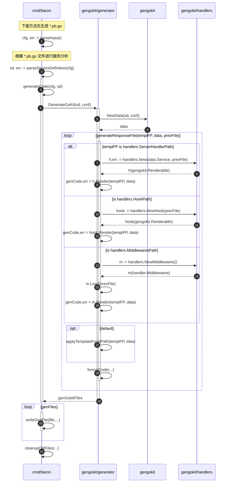

## 项目结构

## Baron CLI

```mermaid
sequenceDiagram
	participant baron as cmd/baron
	participant generator as gengokit/generator
	participant gengokit as gengokit
	participant handlers as gengokit/handlers
  autonumber
  note over baron: 下面方法先生成 *.pb.go
  baron ->> baron: cfg, err := parseInput()
  note over baron: 根据 *.pb.go 文件进行服务分析
  baron ->> baron: sd, err := parseServiceDefinition(cfg)
  activate baron
  baron ->> baron: generateCode(cfg, sd)
	baron ->>+ generator: GenerateGoKit(sd, conf)
	generator ->> gengokit: NewData(sd, conf)
	gengokit -->> generator: data
	loop generateResponseFile(templFP, data, prevFile)
		activate generator
		alt templFP is handlers.ServerHandlerPath
      generator ->> handlers: h,err := handlers.New(data.Service, prevFile)
      handlers -->> generator: h(gengokit.Renderable)
      generator ->> generator: genCode,err = h.Render(templFP, data)
    else is handlers.HookPath
    	generator ->> handlers: hook := handlers.NewHook(prevFile)
      handlers -->> generator: hook(gengokit.Renderable)
      generator ->> generator: genCode,err = hook.Render(templFP, data)
    else is handlers.MiddlewaresPath
     	generator ->> handlers: m := handlers.NewMiddlewares()
      handlers -->> generator: m(handler.Middlewares)
      generator ->> generator: m.Load(prevFile)
      generator ->> generator: genCode,err = m.Render(templFP, data)
		end
		opt default
			 generator ->> generator: applyTemplateFromPath(templFP, data)
		end
		generator ->> generator: formatCode(...)
		deactivate generator
	end
	generator -->>- baron: genGokitFiles
	deactivate baron
	loop genFiles
	activate baron
	baron ->> baron: writeGenFile(file,...)
	deactivate baron
	end
	baron ->> baron: cleanupOldFiles(...)


```

