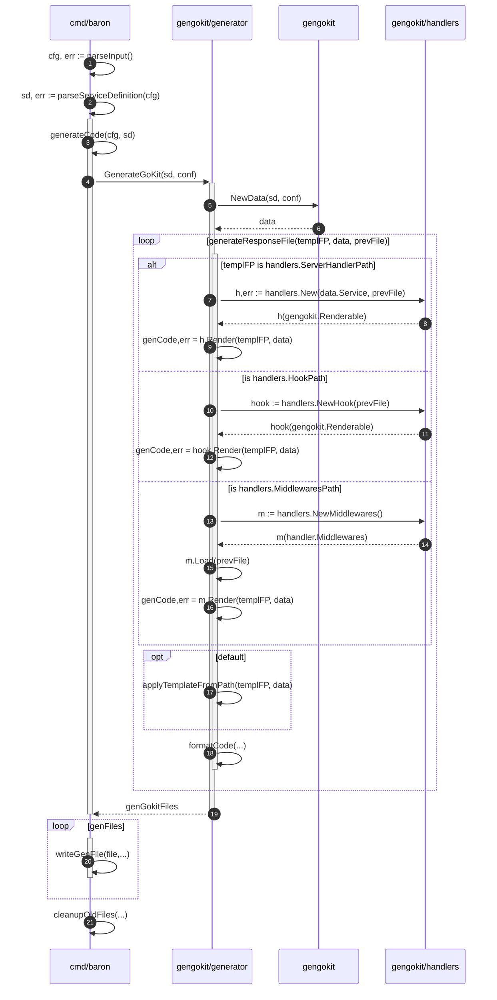

## 项目结构

## Baron CLI




```shell
├── DEVELOPING.md
├── Dockerfile
├── LICENSE
├── LICENSE.md
├── Makefile
├── README.md
├── TUTORIAL.md
├── USAGE.md
├── _example
│   ├── README.md
│   ├── echo.proto
│   └── middlewares
│       └── labeledmiddlewares.go
├── cmd 
│   ├── _integration-tests
│   │   ├── Makefile
│   │   ├── README.md
│   │   ├── middlewares
│   │   │   ├── Makefile
│   │   │   ├── handlers
│   │   │   │   ├── handlers.go
│   │   │   │   └── middlewares.go
│   │   │   ├── middlewares_test.go
│   │   │   ├── proto
│   │   │   │   └── middlewares-test.proto
│   │   │   └── setup_test.go
│   │   ├── server
│   │   │   ├── server_test.go
│   │   │   └── test-service-definitions
│   │   │       ├── 1-basic
│   │   │       ├── 1-multifile
│   │   │       ├── 2-repeated
│   │   │       ├── 3-nested
│   │   │       ├── 4-maps
│   │   │       ├── 5-grpconly
│   │   │       ├── 6-additional_bindings
│   │   │       ├── 7-custom_http_verb
│   │   │       └── 8-message_only
│   │   └── transport
│   │       ├── Makefile
│   │       ├── grpc_test.go
│   │       ├── handlers
│   │       │   ├── handlers.go
│   │       │   └── httperr.go
│   │       ├── http_benchmarks_test.go
│   │       ├── http_test.go
│   │       ├── proto
│   │       │   └── transport-test.proto
│   │       └── setup_test.go
│   └── baron 命令行工具
│       ├── README.md
│       └── main.go
├── commit_date.sh
├── deftree
│   ├── README.md
│   ├── _associate_comments_test.go
│   ├── _build_deftree_test.go
│   ├── associate_comments.go
│   ├── build_deftree.go
│   ├── contextualize.go
│   ├── contextualize_test.go
│   ├── deftree.go
│   ├── gogothirdparty
│   │   ├── LICENSE
│   │   ├── Makefile
│   │   ├── doc.go
│   │   ├── gogo.pb.go
│   │   ├── gogo.pb.golden
│   │   ├── gogo.proto
│   │   └── helper.go
│   └── googlethirdparty
│       ├── LICENSE
│       ├── annotations.pb.go
│       ├── annotations.proto
│       ├── descriptor.proto
│       ├── http.pb.go
│       └── http.proto
├── docs
│   ├── baron.drawio
│   └── baron.png
├── gendoc
│   ├── README.md
│   ├── docs_css.go
│   ├── gendoc.go
│   └── generate_markdown.go
├── gengokit
│   ├── README.md
│   ├── generator
│   │   ├── gen.go
│   │   └── gen_test.go
│   ├── gengokit.go
│   ├── gengokit_test.go
│   ├── gentesthelper
│   │   ├── helper.go
│   │   └── helper_test.go
│   ├── handlers
│   │   ├── handler_test.go
│   │   ├── handlers.go
│   │   ├── hooks.go
│   │   ├── middlewares.go
│   │   ├── middlewares_test.go
│   │   └── templates
│   │       ├── handlers.go
│   │       ├── hook.go
│   │       └── middlewares.go
│   ├── httptransport
│   │   ├── embeddable_funcs.go
│   │   ├── get_source.go
│   │   ├── httptransport.go
│   │   ├── httptransport_test.go
│   │   ├── templates
│   │   │   ├── client.go
│   │   │   └── server.go
│   │   ├── templates_test.go
│   │   └── types.go
│   └── template
│       ├── NAME-service
│       │   ├── cmd
│       │   │   └── NAME
│       │   ├── handlers
│       │   │   ├── handlers.gotemplate
│       │   │   ├── hooks.gotemplate
│       │   │   └── middlewares.gotemplate
│       │   └── svc
│       │       ├── client
│       │       ├── endpoints.gotemplate
│       │       ├── server
│       │       ├── transport_grpc.gotemplate
│       │       └── transport_http.gotemplate
│       ├── gogenerate.go
│       └── template.go
├── go.mod
├── go.sum
├── layout.md
├── svcdef
│   ├── consolidate_http.go
│   ├── consolidate_http_test.go
│   ├── newfromstring.go
│   ├── newfromstring_test.go
│   ├── resolvetypes.go
│   ├── svcdef.go
│   ├── svcdef_test.go
│   ├── svcparse
│   │   ├── lexer.go
│   │   ├── lexer_test.go
│   │   ├── parser.go
│   │   ├── parser_test.go
│   │   ├── scanner.go
│   │   ├── scanner_test.go
│   │   └── token.go
│   ├── test-go.txt
│   └── test-proto.txt
├── truss
│   ├── config.go
│   ├── execprotoc 执行protoc命令
│   │   └── execprotoc.go
│   ├── getstarted
│   │   ├── getstarted.go
│   │   ├── getstarted_test.go
│   │   └── template.go
│   └── parsesvcname
│       ├── parsesvcname.go
│       └── parsesvcname_test.go
├── vendor
│   ├── github.com
│   │   ├── davecgh
│   │   │   └── go-spew
│   │   │       ├── LICENSE
│   │   │       └── spew
│   │   ├── gogo
│   │   │   └── protobuf
│   │   │       ├── AUTHORS
│   │   │       ├── CONTRIBUTORS
│   │   │       ├── LICENSE
│   │   │       ├── gogoproto
│   │   │       ├── proto
│   │   │       └── protoc-gen-gogo
│   │   ├── konsorten
│   │   │   └── go-windows-terminal-sequences
│   │   │       ├── LICENSE
│   │   │       ├── README.md
│   │   │       ├── go.mod
│   │   │       └── sequences.go
│   │   ├── pkg
│   │   │   └── errors
│   │   │       ├── LICENSE
│   │   │       ├── README.md
│   │   │       ├── appveyor.yml
│   │   │       ├── errors.go
│   │   │       └── stack.go
│   │   ├── pmezard
│   │   │   └── go-difflib
│   │   │       ├── LICENSE
│   │   │       └── difflib
│   │   ├── sirupsen
│   │   │   └── logrus
│   │   │       ├── CHANGELOG.md
│   │   │       ├── LICENSE
│   │   │       ├── README.md
│   │   │       ├── alt_exit.go
│   │   │       ├── appveyor.yml
│   │   │       ├── doc.go
│   │   │       ├── entry.go
│   │   │       ├── exported.go
│   │   │       ├── formatter.go
│   │   │       ├── go.mod
│   │   │       ├── go.sum
│   │   │       ├── hooks.go
│   │   │       ├── json_formatter.go
│   │   │       ├── logger.go
│   │   │       ├── logrus.go
│   │   │       ├── terminal_check_appengine.go
│   │   │       ├── terminal_check_bsd.go
│   │   │       ├── terminal_check_no_terminal.go
│   │   │       ├── terminal_check_notappengine.go
│   │   │       ├── terminal_check_solaris.go
│   │   │       ├── terminal_check_unix.go
│   │   │       ├── terminal_check_windows.go
│   │   │       ├── text_formatter.go
│   │   │       └── writer.go
│   │   └── spf13
│   │       └── pflag
│   │           ├── LICENSE
│   │           ├── README.md
│   │           ├── bool.go
│   │           ├── bool_slice.go
│   │           ├── bytes.go
│   │           ├── count.go
│   │           ├── duration.go
│   │           ├── duration_slice.go
│   │           ├── flag.go
│   │           ├── float32.go
│   │           ├── float32_slice.go
│   │           ├── float64.go
│   │           ├── float64_slice.go
│   │           ├── go.mod
│   │           ├── go.sum
│   │           ├── golangflag.go
│   │           ├── int.go
│   │           ├── int16.go
│   │           ├── int32.go
│   │           ├── int32_slice.go
│   │           ├── int64.go
│   │           ├── int64_slice.go
│   │           ├── int8.go
│   │           ├── int_slice.go
│   │           ├── ip.go
│   │           ├── ip_slice.go
│   │           ├── ipmask.go
│   │           ├── ipnet.go
│   │           ├── string.go
│   │           ├── string_array.go
│   │           ├── string_slice.go
│   │           ├── string_to_int.go
│   │           ├── string_to_int64.go
│   │           ├── string_to_string.go
│   │           ├── uint.go
│   │           ├── uint16.go
│   │           ├── uint32.go
│   │           ├── uint64.go
│   │           ├── uint8.go
│   │           └── uint_slice.go
│   ├── golang.org
│   │   └── x
│   │       ├── sys
│   │       │   ├── AUTHORS
│   │       │   ├── CONTRIBUTORS
│   │       │   ├── LICENSE
│   │       │   ├── PATENTS
│   │       │   └── unix
│   │       └── tools
│   │           ├── AUTHORS
│   │           ├── CONTRIBUTORS
│   │           ├── LICENSE
│   │           ├── PATENTS
│   │           ├── go
│   │           └── internal
│   └── modules.txt
└── wininstall.bat
```


## 调试信息

```shell
DEBU[0000]                                               GOPATH="[/Users/venjiang/gopath]"
DEBU[0000]                                               rawDefPath=./api/hello/fetcher.proto
DEBU[0000]                                               DefPaths="[/Users/venjiang/gopath/src/test/truss-demo/api/hello/fetcher.proto]"
DEBU[0000]                                               PB Package=test/truss-demo/api/hello
DEBU[0000]                                               PB Path=/Users/venjiang/gopath/src/test/truss-demo/api/hello
DEBU[0000]                                               svcDirName=fetcher-service
DEBU[0000]                                               svcPath=/Users/venjiang/gopath/src/test/truss-demo/api/hello/fetcher-service
DEBU[0000]                                               Service Packages="[test/truss-demo/api/hello/fetcher-service]"
DEBU[0000]                                               Service Package=test/truss-demo/api/hello/fetcher-service
DEBU[0000]                                               package name=
DEBU[0000]                                               Service Path=/Users/venjiang/gopath/src/test/truss-demo/api/hello/fetcher-service
DEBU[0000] Handler being created                         Service Methods=3
```


